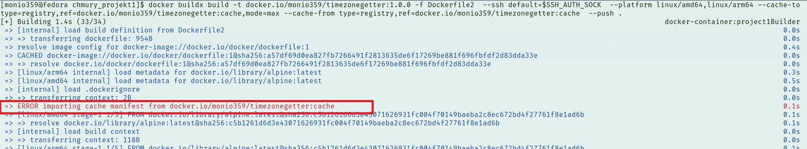
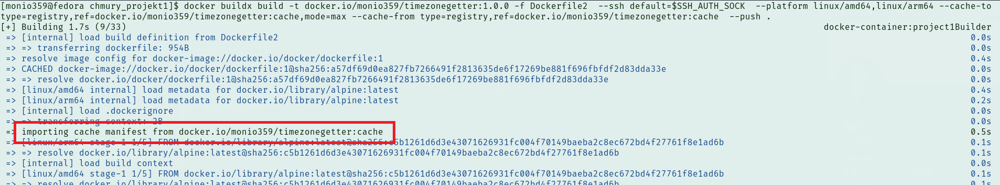
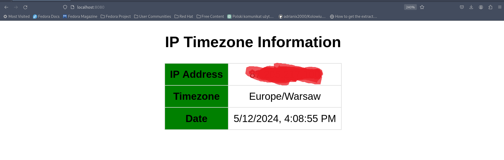

<center>

# Project 1


## University project for programming in cloud computing

</center>

The goal of the project was to create a simple application that, based on the client's IP address, would display information about their time zone and current time and then deploying it in Docker. Application use external api's to [fetching public ip address](https://api.ipify.org/?format=json) and based on it [fetching timezone of a client](https://ipapi.co/timezone). To fetching external api's i use axios and for creating simple web server i use express.

<center>

## The technologies that I used:

</center>

<p align="center">
  
   
  
</p>

## How to deploy and run it in docker ?

In simplest way you can download source from my github and use default dockerfile to create image, using following command:

```bash
docker build --no-cache  -t timezonegetter .
```

Before running the image, you can ensure that it is available locally on your machine:

```bash
docker images --filter reference=timezonegetter
```

You can also check how many layers the newly created image consists of using docker history, which returns a list of temporary images created at each stage of the build process. If the size field is non-zero, it means that the file system of the image has been modified, and we count that sub-image as a layer. Let's not forget about the base layer, which is the Alpine Linux used as the base system. So in this case, the image has 5 layers.

```bash
docker history timezonegetter
```


You can now start a new container using the 'timezonegetter' image. Since it's a server application, it's best to use the '-d' switch to run it in the background. The app inside the container runs on port 4000, so you'll also need to use port forwarding with the '-p' switch. I'm using port 5333 in this case, so I'll check the application's functionality using that port later.

```bash
docker run -d -p 5333:4000 --name timezone_container timezonegetter
```

Now you can verify if the container status is UP, if port forwarding is applied, and if the container is healthy. Inside the Dockerfile, I've used the HEALTHCHECK command, which sends a request to my application every 60 seconds and waits for a response for 15 seconds. If an error occurs or the application doesn't respond within that time, the container is considered unhealthy. As you can see in the screenshot below, the container is in a healthy state

```bash
docker ps -f ancestor=timezonegetter
```


## How it's looks like?

Finally, you can see the application in action by entering localhost:5333 in your browser's address bar. I don't recommend using the curl program because, the application includes a simple frontend, and it wouldn't display correctly in the terminal.


To see server logs, use the following command:

```bash
docker logs timezone_container
```


In the end, you can make sure that the image does not contain any high and critical errors, using docker scout.


## Extended stage of the project.


## Dockerfile modifications 
In this part of the project development, it was necessary to use source code located in a remote GitHub repository. In the first stage of building in Dockerfile2, to access the remote repository, it was necessary to install Git and the OpenSSH client. Using ssh-keyscan, it was necessary to add the GitHub host key to the 'known_hosts' file and finally clone the repository with the code


## Building image process
At the beginning, before starting to build the image, it was necessary to create a new builder for the buildx tool. By using the docker-container driver, we enable multi-platform image building. The bootstrap option allows the initialization of the builder so it is immediately running, and --use specifies the created builder as the default one.

command to create new builder, and at the screen we can see that created builder is default (it has * sign):

```bash
docker buildx create --name project1Builder --driver docker-container --bootstrap --use
```


Now we can go to the image building process. Because during the building process, the image is properly tagged, it will be uploaded to my newly created repository on Docker Hub. With the --platform switch, I indicate on which hardware architectures the image should be built. With --cache-to, I configure the location where layers from the build process will be stored to be reused as cache during latter builds, contributing to increased build process efficiency. Using mode=max means that all layers from the building process will be stored. Then, with --cache-from, we specify from where this cache will be taken, providing the location indicated in --cache-to.

```bash
docker buildx build -t docker.io/monio359/timezonegetter:1.0.0 -f Dockerfile2  --ssh default=$SSH_AUTH_SOCK  --platform linux/amd64,linux/arm64 --cache-to type=registry,ref=docker.io/monio359/timezonegetter:cache,mode=max --cache-from type=registry,ref=docker.io/monio359/timezonegetter:cache  --push .
```

building without cache logs:


building with cache logs:


## Running image 

You can download image from my DockerHub using following command:

```bash
docker pull monio359/timezonegetter:1.0.0
```

And next run container using following command, this time i used port 8080 for difference:
```bash
docker run -d -p 8080:4000 --name extended_project  monio359/timezonegetter:1.0.0 
```

## How it's looks like:




