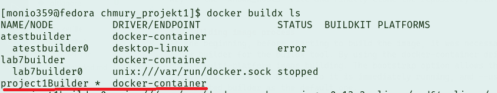
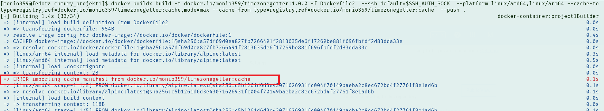
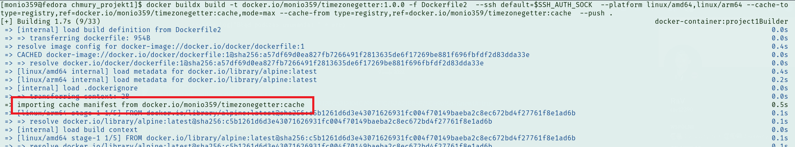
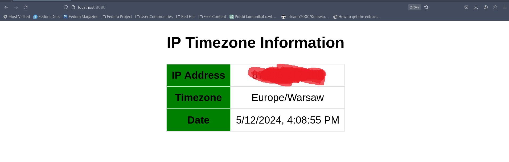

# Extended stage of the project.


## Dockerfile modifications 
In this part of the project development, it was necessary to use source code located in a remote GitHub repository. In the first stage of building in Dockerfile2, to access the remote repository, it was necessary to install Git and the OpenSSH client. Using ssh-keyscan, it was necessary to add the GitHub host key to the 'known_hosts' file and finally clone the repository with the code


## Building image process
At the beginning, before starting to build the image, it was necessary to create a new builder for the buildx tool. By using the docker-container driver, we enable multi-platform image building. The bootstrap option allows the initialization of the builder so it is immediately running, and --use specifies the created builder as the default one.

command to create new builder, and at the screen we can see that created builder is default (it has * sign):

```bash
docker buildx create --name project1Builder --driver docker-container --bootstrap --use
```



Now we can go to the image building process. Because during the building process, the image is properly tagged, it will be uploaded to my newly created repository on Docker Hub. With the --platform switch, I indicate on which hardware architectures the image should be built. With --cache-to, I configure the location where layers from the build process will be stored to be reused as cache during latter builds, contributing to increased build process efficiency. Using mode=max means that all layers from the building process will be stored. Then, with --cache-from, we specify from where this cache will be taken, providing the location indicated in --cache-to.

```bash
docker buildx build -t docker.io/monio359/timezonegetter:1.0.0 -f Dockerfile2  --ssh default=$SSH_AUTH_SOCK  --platform linux/amd64,linux/arm64 --cache-to type=registry,ref=docker.io/monio359/timezonegetter:cache,mode=max --cache-from type=registry,ref=docker.io/monio359/timezonegetter:cache  --push .
```

building without cache logs:


building with cache logs:


## Running image 

You can download image from my DockerHub using following command:

```bash
docker pull monio359/timezonegetter:1.0.0
```

And next run container using following command, this time i used port 8080 for difference:
```bash
docker run -d -p 8080:4000 --name extended_project  monio359/timezonegetter:1.0.0 
```

### How it's looks like:




